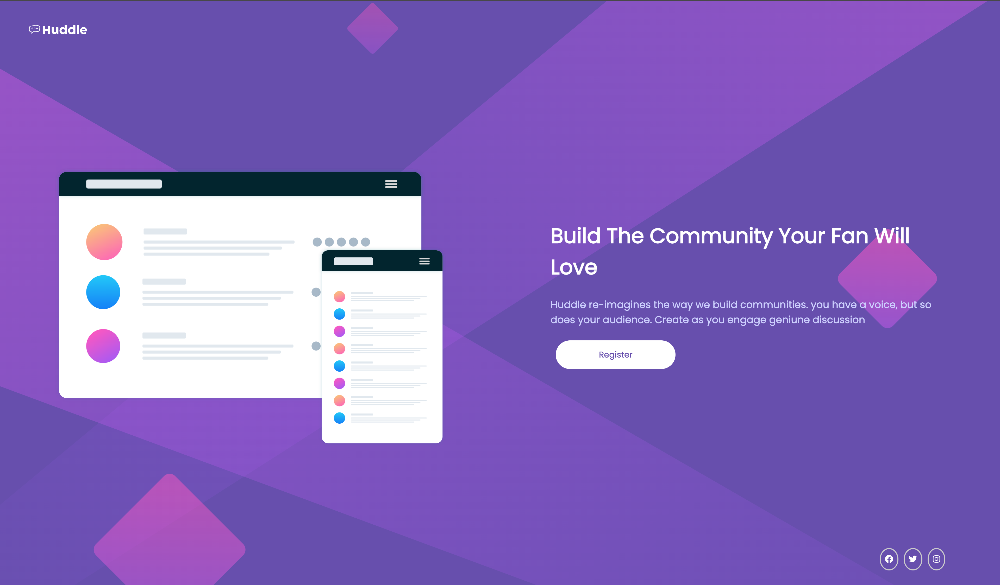

# Frontend Mentor - Huddle landing page with single introductory section solution

This is a solution to the [Huddle landing page with single introductory section challenge on Frontend Mentor](https://www.frontendmentor.io/challenges/huddle-landing-page-with-a-single-introductory-section-B_2Wvxgi0). Frontend Mentor challenges help you improve your coding skills by building realistic projects.

## Table of contents

- [Overview](#overview)
  - [The challenge](#the-challenge)
  - [Screenshot](#screenshot)
- [My process](#my-process)
  - [Built with](#built-with)
  - [What I learned](#what-i-learned)
  - [Continued development](#continued-development)
  - [Useful resources](#useful-resources)
- [Author](#author)

## Overview

### The challenge

Users should be able to:

- View the optimal layout for the page depending on their device's screen size
- See hover states for all interactive elements on the page

### Screenshot



### Links

- Solution URL: [Add solution URL here](https://github.com/mahdiabubakar/huddle-landing-page)
- Live Site URL: [Add live site URL here](https://pedantic-hopper-66a257.netlify.app/)

## My process

### Built with

- Semantic HTML5 markup
- CSS custom properties
- Flexbox
- Mobile-first workflow

### What I learned

Use this section to recap over some of your major learnings while working through this project. Writing these out and providing code samples of areas you want to highlight is a great way to reinforce your own knowledge.

To see how you can add code snippets, see below:

```html
<h1>Some HTML code I'm proud of</h1>
```

```css
.proud-of-this-css {
  color: hsl(257, 40%, 49%);
}
```

```js
const proudOfThisFunc = () => {
  console.log('No JS in this exercise');
};
```

### Continued development

Next, I will be focusing on many projects, frontend and app using React and ReactNatie respectively.

### Useful resources

- [Example resource 1](https://www.w3schools.com/colors/colors_hsl.asp) - This helped me undertanding hsl colors. I really liked this pattern and will use it going forward.
-

## Author

- Website - [Mahdi](https://www.mahdiabubakar.me)
- Frontend Mentor - [@mahdiabubakar](https://www.frontendmentor.io/profile/mahdiabubakar)
- Twitter - [@NigerianCoder](https://www.twitter.com/yourusername)
